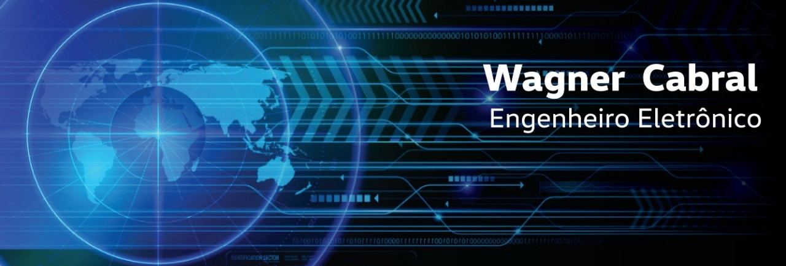

   

  

# Wagner Cabral
*Engenheiro Eletrônico*

Pensamento analítico para resolver problemas com base em modelos matemáticos, e dados estatísticos. Experiência prática em análise técnica com ações na B3 e criptomoedas. Sempre aberto a aprender novas ferramentas para otimização de resultados.

Técnico em eletrônica formado pelo Instituto Federal de Alagoas (IFAL) e engenheiro eletrônico formado pela Universidade Federal de Pernambuco (UFPE).

**Conhecimentos em:** VBA, Python, Otimização de processos, modelos matematicos, análise técnica, eletrônica analógica.

**Links:**
* [LinkedIn](https://www.linkedin.com/in/wagner-cabral-74a89418a/)

## Projetos:
Alguns artigos sobre os meus trabalhos:

* **Otimização de linha de produção de quadros de distribuição** https://bit.ly/3o5yilP

---
